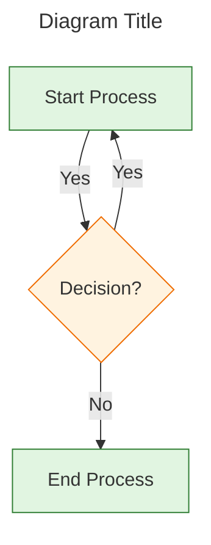

# vsd-to-mmd — Visio to Mermaid Conversion

## Purpose

Convert Microsoft Visio diagrams (.vsd, .vsdx) into Mermaid (.mmd) text format
— making them LLM-consumable, human-editable, and version-controllable.

The conversion pipeline:
1. **Visio → SVG** using LibreOffice headless (soffice)
2. **SVG → Mermaid** using Claude Vision to analyze structure and generate .mmd

## When to use

- You have Visio files that need to be searchable or editable as text
- You want diagrams in version control (Git) with meaningful diffs
- You need LLM-readable diagrams for analysis or documentation
- You have multi-page Visio diagrams chopped into PDF pages
- You want to migrate from proprietary formats to open standards

## Prerequisites

### Option 1: LibreOffice (Full conversion - recommended)

LibreOffice must be installed with command-line support:

**Windows (requires admin):**
```bash
winget install TheDocumentFoundation.LibreOffice --silent
```

**macOS:**
```bash
brew install --cask libreoffice
```

**Linux:**
```bash
sudo apt-get install libreoffice
```

Verify installation:
```bash
soffice --version
```

### Option 2: draw.io Online (No admin required)

If you cannot install LibreOffice (no admin privileges), use draw.io:

1. Go to https://app.diagrams.net/
2. **File → Import From → Device** → Select your `.vsdx` file
3. **File → Export as → SVG** → Save the SVG file
4. Use this skill's `analyze` command on the exported SVG:
   ```bash
   python scripts/vsd_to_mmd.py analyze diagram.svg -o diagram.mmd
   ```

**Pros:** No installation, works on any machine  
**Cons:** Manual step for each file, multi-page diagrams need separate exports

### Option 3: draw.io Desktop (Portable)

Download the portable draw.io desktop app (no admin required):
- https://github.com/jgraph/drawio-desktop/releases
- Download `draw.io-...-windows-no-installer.exe`
- Run directly, import Visio, export as SVG

### Python

Python 3.9+ with optional packages:
```bash
pip install click rich pillow cairosvg
```

## Process

### 1. Convert Visio to SVG

```bash
python scripts/vsd_to_mmd.py convert <input.vsdx> [-o output_dir/]
```

This:
- Invokes LibreOffice headless to convert each page to SVG
- Names outputs `<basename>_page_01.svg`, `<basename>_page_02.svg`, etc.
- Handles both .vsd and .vsdx formats

### 2. Convert SVG to Mermaid

```bash
python scripts/vsd_to_mmd.py analyze <input.svg> [-o output.mmd]
```

This:
- Uses Claude Vision to analyze the SVG structure
- Generates Mermaid diagram code (.mmd)
- Saves as a `.mmd` file

### 3. Batch convert entire Visio file

```bash
python scripts/vsd_to_mmd.py batch <input.vsdx> [-o output_dir/]
```

This runs both steps automatically for all pages.

## Output format

### Mermaid (.mmd) structure



### File naming

| Input | Output |
|-------|--------|
| `diagram.vsdx` | `diagram_page_01.mmd`, `diagram_page_02.mmd`, ... |
| `flow.vsd` | `flow_page_01.mmd`, `flow_page_02.mmd`, ... |

## Interactive mode

For complex diagrams, use interactive mode to refine the conversion:

```bash
python scripts/vsd_to_mmd.py interactive <input.vsdx>
```

This:
1. Converts Visio to SVG
2. Shows you the SVG (as text description)
3. Lets you guide the Mermaid generation with prompts like:
   - "This is a data flow diagram"
   - "Group these nodes into a subgraph"
   - "Use sequence diagram instead of flowchart"

## Python API

Use programmatically in scripts:

```python
from scripts.vsd_to_mmd import VisioConverter

converter = VisioConverter()

# Step 1: Visio to SVG
svg_paths = converter.visio_to_svg("diagram.vsdx", output_dir="./svgs/")

# Step 2: SVG to Mermaid (requires Claude Vision)
mmd_content = converter.svg_to_mmd(svg_paths[0], diagram_type="flowchart")

# Or batch convert
results = converter.batch_convert("diagram.vsdx", output_dir="./mmd/")
```

## Handling complex diagrams

### Multi-page Visio files

Each page becomes a separate `.mmd` file with page metadata:

```yaml
---
title: Data Flow - Page 2
source: EAA_Data_Flow.vsdx
page: 2
page_name: "System Boundaries"
---
```

### Diagram type detection

The skill attempts to detect diagram types:

| Visio Template | Mermaid Type |
|---------------|--------------|
| Basic Flowchart | `flowchart TD/LR` |
| Cross-Functional Flow | `flowchart` with subgraphs |
| Data Flow | `flowchart` or `graph` |
| UML Sequence | `sequenceDiagram` |
| UML Class | `classDiagram` |
| Entity Relationship | `erDiagram` |
| Network | `flowchart` with icons |
| Timeline | `timeline` |

### Manual type override

If detection fails, specify the type:

```bash
python scripts/vsd_to_mmd.py analyze page.svg -o out.mmd --type sequenceDiagram
```

## Troubleshooting

### LibreOffice not found / No admin privileges

```
Error: soffice not found in PATH
```

**Option A - If you have admin:** Add LibreOffice to PATH or use `--soffice-path`:
```bash
python scripts/vsd_to_mmd.py convert diagram.vsdx --soffice-path "/c/Program Files/LibreOffice/program/soffice.exe"
```

**Option B - No admin (use draw.io):**
1. Go to https://app.diagrams.net/
2. File → Import From → Device → Select your `.vsdx`
3. File → Export as → SVG
4. Then run: `python scripts/vsd_to_mmd.py analyze exported.svg -o output.mmd`

**Option C - Portable LibreOffice (limited):**
LibreOffice Portable exists but the Visio import filter often requires system registration that needs admin rights. draw.io is more reliable without admin.

### Conversion produces empty SVG

Some complex Visio features may not convert. Workarounds:
1. Simplify the Visio diagram (ungroup complex shapes)
2. Export as PDF from Visio, then use `pdf2svg`
3. Use the interactive mode to guide reconstruction

### Mermaid diagram is too complex

Large diagrams may exceed Mermaid rendering limits. Solutions:
1. Split into multiple `.mmd` files using subgraphs
2. Use `flowchart` instead of `graph` (better performance)
3. Simplify: remove decorative elements, keep structure

## Notes

- **Preservation**: The conversion preserves structure and relationships, not pixel-perfect styling
- **Text**: All text content is extracted and preserved
- **Shapes**: Converted to Mermaid node shapes (`[]`, `{}`, `()`, `[[]]`, etc.)
- **Colors**: Captured as Mermaid class definitions (optional)
- **Links**: Hyperlinks are preserved as Mermaid click events
- **Layers**: Visio layers become Mermaid subgraphs or are flattened

## See also

- Mermaid syntax: https://mermaid.js.org/syntax/flowchart.html
- LibreOffice headless docs: https://wiki.documentfoundation.org/Development/LibreOffice_Impress_Migration
- For PDF-based Visio exports, use `pdf-md` skill first to extract structure
